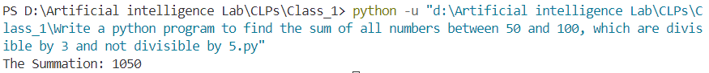

<ul>
<li>Write a python program to find the factorial of a number using for loop.</li>
<b>Output: </b> 

<!--  -->

<li>Write a python program to find the largest number between two numbers using function.</li>
<b>Output: </b> 

<li>Write a python program to find the second highest number from a set Of numbers.</li>
<b>Output: </b> 

<li>Write a python program to find the smallest number from a set Of numbers.</li>
<b>Output: </b> 

<li>Write a python program to find the sum of all numbers between 50 and 100, which are divisible by 3 and not divisible by 5.</li>
<b>Output: </b> 

<li>Write a python program to find the sum Of Odd and even numbers from a set Of numbers.</li>
<b>Output: </b> 

<li>Write a python program to find the sum of the numbers passed as parameters.</li>
<b>Output: </b> 

<li>Write a python program to generate Fibonacci series.</li>
<b>Output: </b> 

</ul>
